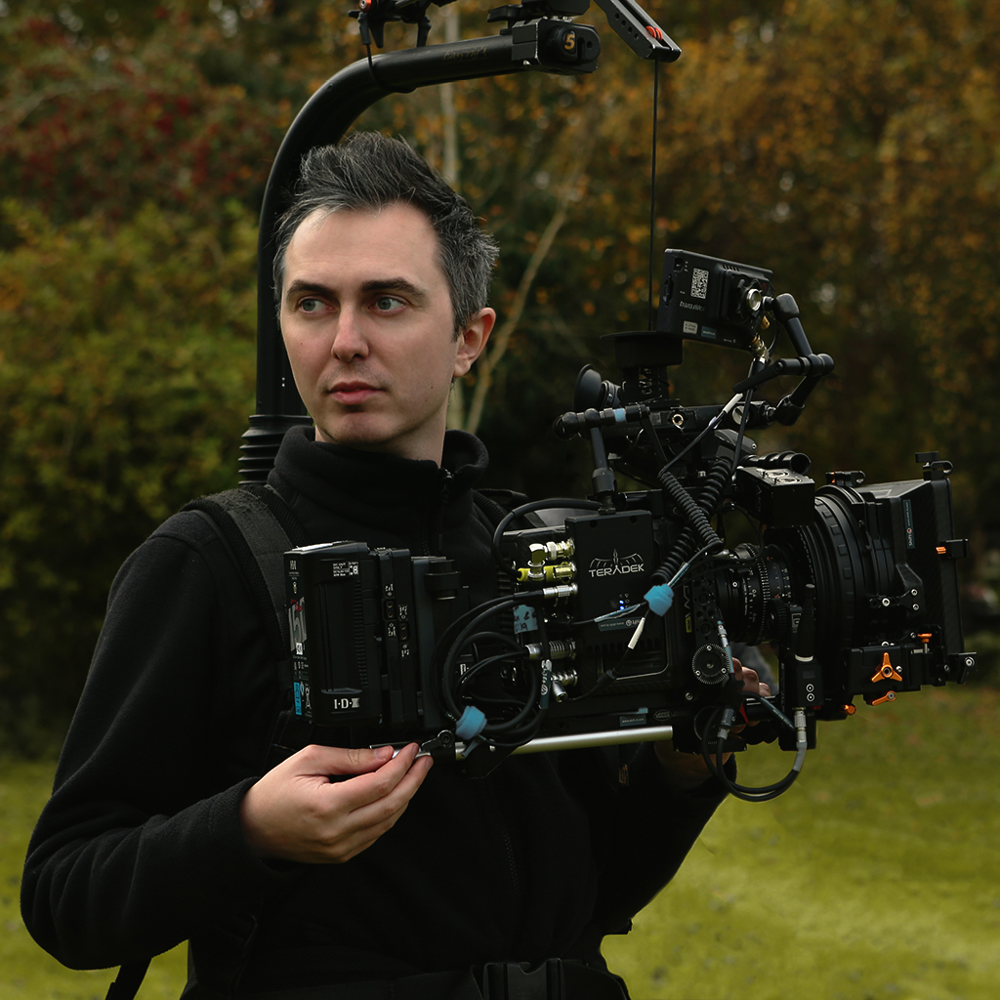

<article>
  

    

      

        
        
      

      

        
Andrei is a London based cinematographer whose practice lies at the intersection of arthouse film and popular culture.

He grew up in a working-class family in a small city in Romania where cable tv and the occasional, and most coveted, cinema visit moulded his eclectic taste and opened a portal to different worlds, struggles and life stories.

Following the encouragement of one of his high-school teachers, Andrei started making 8mm video shorts in his teens which offered him an opportunity to express himself and to reflect on the world around him with incisiveness and compassion.

These formative experiences inspired and empowered him to apply for and receive a scholarship at National Film and Theatre University in Bucharest from which he graduated with honours. His graduation film was screened at the Cannes International Film Festival Short Film Corner.

Growing up in the cultural tapestry that is the shore of the Black Sea, Andrei was exposed to a diverse array of life experiences and art filled with tragedy and delight which shaped his journey towards truth, creativity and empathy.

To all of his projects, he brings his endlessly curious mind and an approach based on intuitive creative problem solving, complete dedication and his ever-developing, worldly knowledge and love for filmmaking.

Andrei’s goal is to empower his collaborators with his artistic taste and technical know-how in order to create works that excite, stimulate and challenge their audiences in a pursuit to reveal the truths in themselves and to bring them closer to one another.

        

      

    

  

</article>
